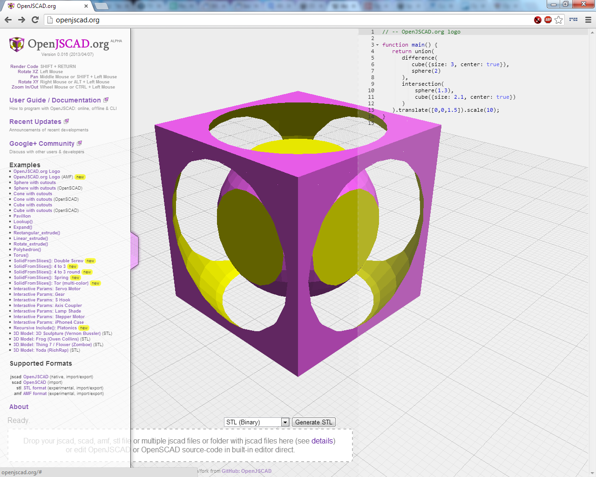
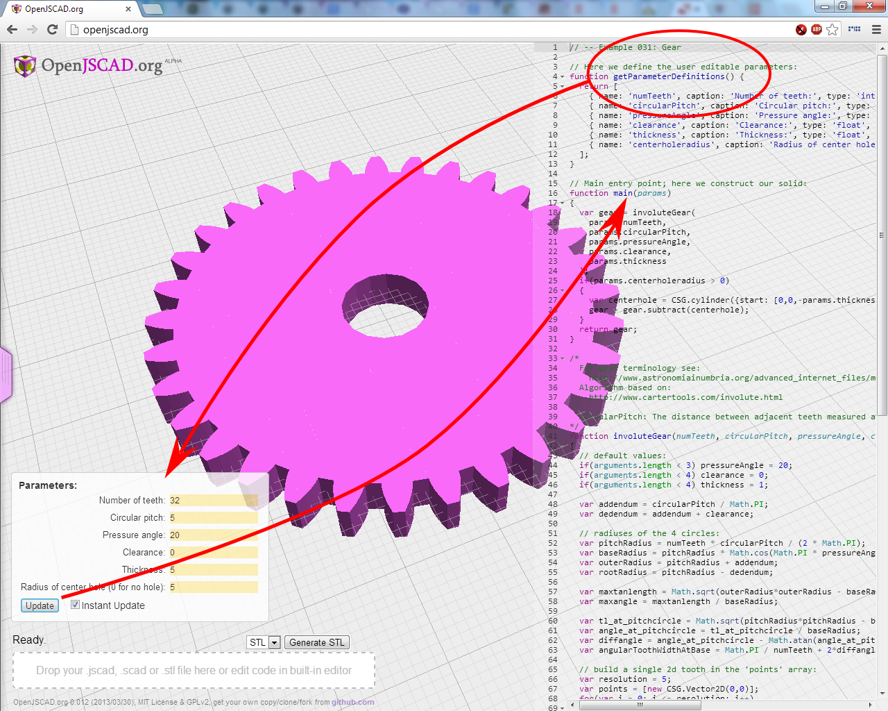
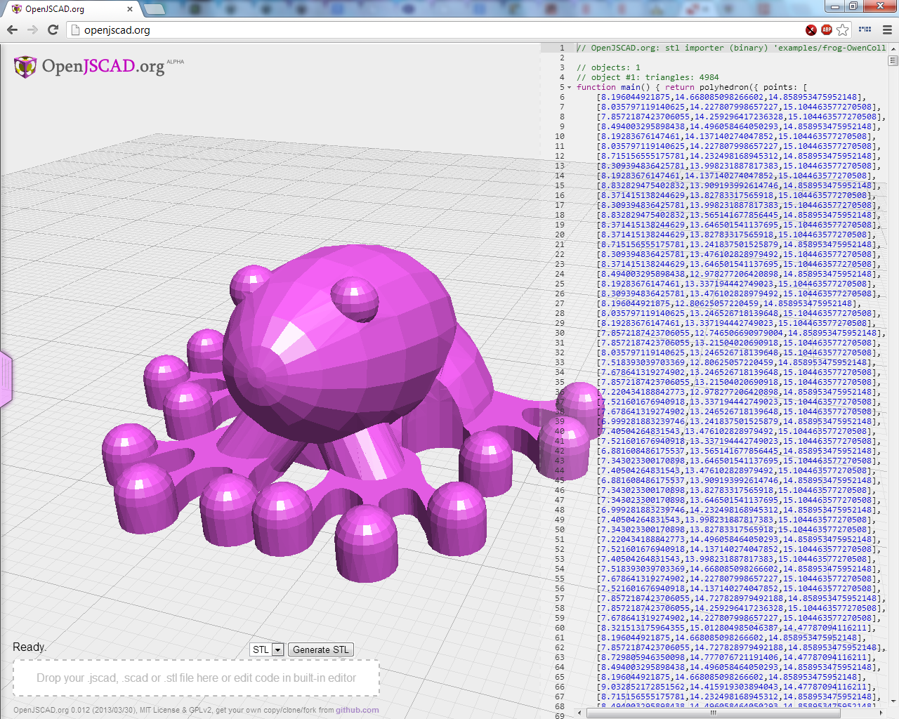
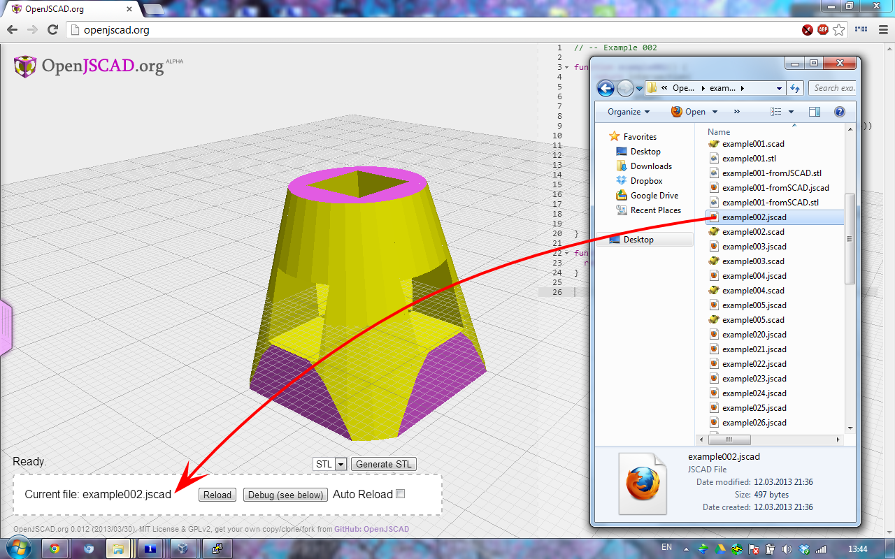
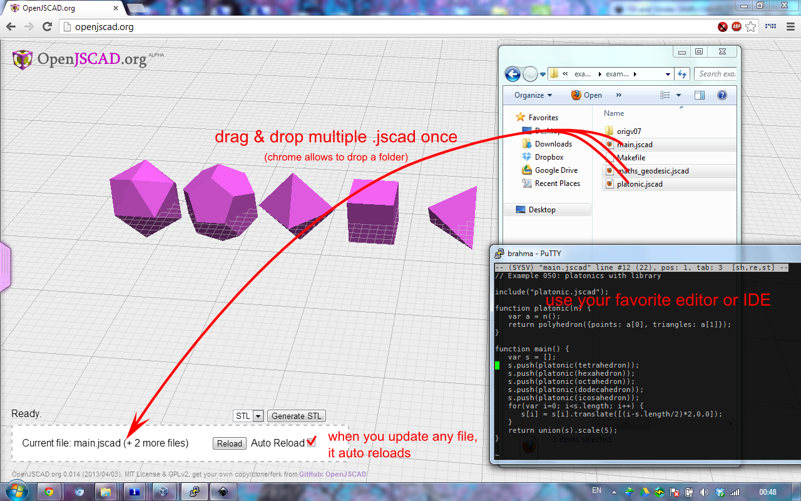

# OpenJSCAD

>*OpenJSCAD* 是一组模块化的浏览器和命令行工具，用于使用JS代码创建设计2D和3D模型


### 立即使用

 *[OpenJSCAD.org](http://openjscad.org)*

### DIY Web服务


```
git clone https://github.com/GJXSTAR/OpenJSCAD.org
pip install flask
python server.py   # 启动Web服务器
```
通过网站的URL访问内容。
  * index.html
  * minimal.html
  * viewer-options.html

> 简单的从 [GitHub:OpenJSCAD](https://github.com/jscad/OpenJSCAD.org)
项目中把 `index.js`, `min.js`, `opt.js`以及`examples`等静态资源拷贝到
`flask`服务中

## 文档

- [OpenJSCAD用户和编程指南](https://openjscad.org/dokuwiki/doku.php?id=start)
- [OpenJSCAD快速参考](https://openjscad.org/dokuwiki/doku.php?id=jscad_quick_reference)

## 社区

* [G+ OpenJSCAD.org Announcements](https://plus.google.com/communities/114958480887231067224)
* [G+ OpenJSCAD Community](https://plus.google.com/communities/114958480887231067224)


## 示例截图
简单的示例

[logo.jscad](static/examples/logo.jscad)的[示例](http://openjscad.org/#examples/logo.jscad):



更复杂的示例，具有用于对象生成和交互式参数的功能

[gear.jscad](static/examples/gear.jscad)的[示例](http://openjscad.org/#examples/gear.jscad) :



导入STL模型

[frog-OwenCollins.stl](static/examples/frog-OwenCollins.stl)的[示例](http://openjscad.org/#examples/frog-OwenCollins.stl):



选择本地文件：


选择多个文件(支持Chrome和Firefox)或选择文件夹(支持Chrome):


